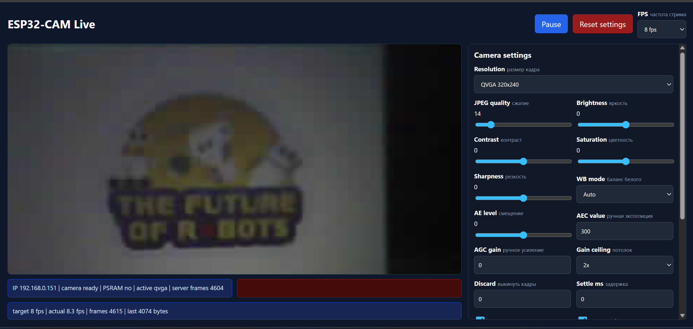

# ESP32-CAM AI Thinker

Russian version: [README.md](README.md)



This project contains two separate PlatformIO firmware environments for an
AI Thinker ESP32-CAM with an OV2640 camera:

- `diagnostic`: serial-only board, camera, and PSRAM diagnostics, no Wi-Fi.
- `web_photo`: Wi-Fi web UI with JPEG-polling live view, camera controls,
  saved settings, and reset-to-defaults.

## Local Setup

Python 3 and Git are required. Check that both are available:

```powershell
python --version
git --version
```

Create a local virtual environment and install the tools:

```powershell
python -m venv .venv
.\.venv\Scripts\python.exe -m pip install --upgrade pip
.\.venv\Scripts\python.exe -m pip install platformio esptool
```

Check PlatformIO:

```powershell
.\.venv\Scripts\pio.exe --version
```

PlatformIO and esptool are used from the local `.venv`. PlatformIO stores its
packages in the local `.platformio` directory, so the project does not need to
write dependencies into the user's home directory. `.venv`, `.platformio`, and
`.pio` are not committed.

Build the diagnostic firmware:

```powershell
.\esp32cam.cmd build -Environment diagnostic
```

List currently openable serial ports:

```powershell
.\esp32cam.cmd ports
```

Check the ESP32 port without flashing:

```powershell
.\esp32cam.cmd chip -Ports COM7
```

Upload the diagnostic firmware:

```powershell
.\esp32cam.cmd upload -Port COM7 -Environment diagnostic
```

Build the web firmware:

```powershell
.\esp32cam.cmd build -Environment web_photo
```

Upload the web firmware:

```powershell
.\esp32cam.cmd upload -Port COM7 -Environment web_photo
```

Open the serial monitor:

```powershell
.\esp32cam.cmd monitor -Port COM7
```

## Web Firmware

`web_photo` connects to the configured Wi-Fi network, prints its IP address to
the serial monitor, and starts an HTTP server on port `80`.

Before building for your own network, copy the secrets example:

```powershell
Copy-Item src\web_photo\wifi_secrets.example.h src\web_photo\wifi_secrets.h
```

Then fill `WIFI_SSID` and `WIFI_PASSWORD` in
`src\web_photo\wifi_secrets.h`. This file is listed in `.gitignore` and must not
be committed.

Endpoints:

- `GET /`: web UI.
- `GET /frame?res=qqvga|qvga|vga&fps=1|2|5|8|10`: one JPEG frame for the
  live-view polling loop.
- `GET` or `POST /capture?res=qqvga|qvga|vga`: compatibility alias for one
  JPEG frame.
- `GET /status`: JSON with IP, PSRAM, camera state, active/saved resolution,
  frame count, saved sensor settings, and the last camera error.
- `GET` or `POST /settings/reset`: reset saved web-firmware settings.

The UI shows one live display and a camera settings panel: JPEG quality,
brightness, contrast, saturation, sharpness, white balance, exposure, gain,
mirror, flip, lens correction, and optional warm-up frame discard. Live view
starts at `2 fps`; `1`, `5`, `8`, and `10 fps` can be selected without
reflashing.

`web_photo` settings are stored in ESP32 NVS/Preferences and restored after
reboot. The UI reads `/status` before the first frame, applies saved values to
the controls, and writes NVS only when a setting actually changes.

If PSRAM does not work, the web firmware uses one frame buffer in DRAM. The
practical modes for this board are usually `QQVGA` and `QVGA`; `VGA` is exposed
in the UI, but may return HTTP 503 if there is not enough memory.

## Hardware and Limitations

Tested with an AI Thinker ESP32-CAM with OV2640 and a CH340 USB-UART adapter.
The working port for this setup was `COM7`.

Important limitations:

- many ESP32-CAM clone boards look like AI Thinker modules, but PSRAM may be
  missing or broken;
- without working PSRAM, prefer `QQVGA` or `QVGA`;
- `VGA` is exposed for testing, but may fail with HTTP 503 without PSRAM;
- live view uses JPEG polling so camera settings remain responsive even without
  PSRAM.

## Bootloader Mode

If upload cannot connect, put the board into bootloader mode:

1. Connect `IO0` to `GND` or hold `BOOT`.
2. Press and release `RST`.
3. Run the upload command.
4. Disconnect `IO0` from `GND` or release `BOOT`.
5. Press `RST` again to start the firmware.

Successful diagnostic serial output should include:

```text
camera init ok
capture ok: <bytes> bytes
jpeg markers: ok
probe done
```

The diagnostic firmware also prints a heartbeat every 2 seconds:

```text
heartbeat: <ms> ms, camera: ready, count: <n>
```

## If The Monitor Is Empty

First check the real openable port:

```powershell
.\esp32cam.cmd ports
```

For this board, the working port was `COM7`.

If upload prints `Failed to connect to ESP32: No serial data received`:

1. Hold `BOOT` or connect `IO0` to `GND`.
2. Press and release `RST` while `BOOT/IO0` is active.
3. Run `.\esp32cam.cmd upload -Port COM7 -Environment web_photo`.
4. Release `BOOT` or disconnect `IO0-GND`.
5. Open `.\esp32cam.cmd monitor -Port COM7`.
6. Press and release `RST`.
