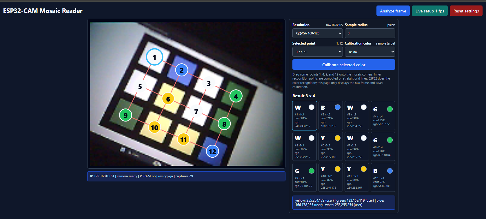
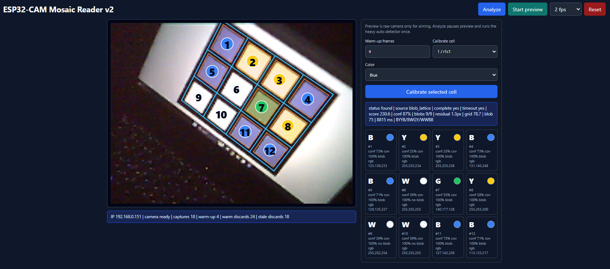

# ESP32-CAM AI Thinker

Набор прошивок для AI Thinker ESP32-CAM с камерой OV2640. Проект начинался как
быстрая проверка платы и камеры, а дальше вырос в несколько отдельных режимов:
веб-просмотр, ручная настройка мозаики и автоматическое чтение мозаики для
робота.

English version: [README.en.md](README.en.md)


## Что внутри

- `diagnostic`: минимальная диагностика платы, камеры и PSRAM через Serial,
  без Wi-Fi.
- `web_photo`: веб-интерфейс с live-view через JPEG polling, настройками камеры,
  сохранением настроек в NVS и сбросом к значениям по умолчанию.
- `mosaic_reader`: ручная настройка 4x3 мозаики. ESP32 читает raw RGB565 кадр,
  ждёт стабилизации AWB/AEC/AGC через warm-up кадры, берет цвет с 12 точек и
  сам классифицирует `yellow`, `green`, `blue`, `white`.
- `mosaic_reader_v2`: однокадровый детектор для робота. Один HTTP-запрос
  делает один кадр, ESP32 сам ищет мозаику в кадре и возвращает 12 цветов.

Все прошивки живут в одном PlatformIO-проекте, но собираются как отдельные
окружения. Они не компилируются вместе и не мешают друг другу.

## Быстрый старт

Нужны Python 3 и Git:

```powershell
python --version
git --version
```

Локально поставить PlatformIO и esptool:

```powershell
python -m venv .venv
.\.venv\Scripts\python.exe -m pip install --upgrade pip
.\.venv\Scripts\python.exe -m pip install platformio esptool
```

Проверить установку:

```powershell
.\.venv\Scripts\pio.exe --version
```

PlatformIO использует локальную `.platformio`, а инструменты лежат в `.venv`.
Обе папки игнорируются Git, поэтому зависимости не попадают в репозиторий.

## Команды

Показать доступные serial-порты:

```powershell
.\esp32cam.cmd ports
```

Проверить, что ESP32 отвечает на выбранном порту:

```powershell
.\esp32cam.cmd chip -Ports COM7
```

Собрать прошивку:

```powershell
.\esp32cam.cmd build -Environment diagnostic
.\esp32cam.cmd build -Environment web_photo
.\esp32cam.cmd build -Environment mosaic_reader
.\esp32cam.cmd build -Environment mosaic_reader_v2
```

Залить прошивку:

```powershell
.\esp32cam.cmd upload -Port COM7 -Environment diagnostic
.\esp32cam.cmd upload -Port COM7 -Environment web_photo
.\esp32cam.cmd upload -Port COM7 -Environment mosaic_reader
.\esp32cam.cmd upload -Port COM7 -Environment mosaic_reader_v2
```

Открыть serial monitor:

```powershell
.\esp32cam.cmd monitor -Port COM7
```

Если upload не стартует, переведи плату в bootloader mode: зажми `BOOT` или
соедини `IO0` с `GND`, нажми `RST`, запусти upload, затем отпусти `BOOT` и снова
нажми `RST`.

## Wi-Fi секреты

Wi-Fi прошивки не хранят реальные SSID/пароль в Git. Перед сборкой нужной
прошивки скопируй пример:

```powershell
Copy-Item src\web_photo\wifi_secrets.example.h src\web_photo\wifi_secrets.h
Copy-Item src\mosaic_reader\wifi_secrets.example.h src\mosaic_reader\wifi_secrets.h
Copy-Item src\mosaic_reader_v2\wifi_secrets.example.h src\mosaic_reader_v2\wifi_secrets.h
```

Заполни `WIFI_SSID` и `WIFI_PASSWORD` в нужном `wifi_secrets.h`. Эти файлы уже
добавлены в `.gitignore`.

## Диагностика (`diagnostic`)

`diagnostic` нужен, чтобы быстро понять, жива ли плата и видит ли ESP32 камеру.
Wi-Fi не используется: вся информация печатается в serial monitor.

Успешный запуск выглядит примерно так:

```text
camera init ok
capture ok: <bytes> bytes
jpeg markers: ok
probe done
```

Также прошивка печатает heartbeat каждые 2 секунды:

```text
heartbeat: <ms> ms, camera: ready, count: <n>
```

Диагностика дополнительно показывает состояние PSRAM, размер свободной heap,
pinout AI Thinker и результат SCCB/I2C scan камеры.

## Веб-фото (`web_photo`)

`web_photo` подключается к Wi-Fi, печатает IP в serial monitor и поднимает
HTTP-сервер на порту `80`.

Интерфейс даёт один live-дисплей и панель настроек камеры: JPEG quality,
brightness, contrast, saturation, sharpness, white balance, exposure, gain,
mirror, flip, lens correction и warm-up frame discard. Live-view работает через
JPEG polling. По умолчанию стоит `2 fps`; можно выбрать `1`, `5`, `8` или
`10 fps`.

Настройки сохраняются в ESP32 NVS/Preferences и восстанавливаются после
перезагрузки. UI сначала читает `/status`, применяет сохраненные значения к
controls и пишет NVS только после реального изменения настройки.

HTTP API:

- `GET /`: веб-интерфейс.
- `GET /frame?res=qqvga|qvga|vga&fps=1|2|5|8|10`: один JPEG-кадр для live-view.
- `GET` или `POST /capture?res=qqvga|qvga|vga`: совместимый alias для одного
  JPEG-кадра.
- `GET /status`: IP, PSRAM, состояние камеры, активное и сохраненное разрешение,
  счетчики, настройки сенсора и последняя ошибка.
- `GET` или `POST /settings/reset`: сброс сохраненных настроек.

Если PSRAM не работает, прошивка использует один frame buffer в DRAM.
Практичные режимы для такой платы: `QQVGA` и `QVGA`. `VGA` оставлен в UI для
проверки, но без PSRAM может вернуть HTTP 503.

## Ручной Mosaic Reader (`mosaic_reader`)



`mosaic_reader` подходит, когда камера стоит стабильно, а сетку можно один раз
настроить руками. В UI двигаются углы `1`, `4`, `9`, `12`; остальные точки
считаются как ровная 4x3 сетка. Браузер только показывает raw кадр и отправляет
настройки, распознавание выполняется на ESP32.

Что делает прошивка:

- снимает raw `RGB565` кадр;
- выбрасывает warm-up/stale кадры, чтобы автоэкспозиция и баланс белого успели
  стабилизироваться;
- берет небольшой patch вокруг каждой из 12 точек;
- игнорирует почти черные пиксели рамки, если точка попала близко к границе;
- классифицирует цвет по нормализованным долям `R/(R+G+B)`, `G/(R+G+B)`,
  `B/(R+G+B)`.

HTTP API:

- `GET /`: setup UI с raw RGB565 preview, сеткой, угловыми handles, калибровкой
  и таблицей результата 3x4.
- `GET /frame?res=qqvga|qvga&radius=0..10&warmup=0..8`: один RGB565 кадр плюс
  результат в headers.
- `GET /result?res=qqvga|qvga&radius=0..10&warmup=0..8`: только JSON результата.
- `GET /status`: IP, камера, PSRAM, resolution, radius, warm-up, counters,
  точки, calibration status и last result.
- `POST /points`: сохранить 12 нормализованных координат в NVS.
- `POST /calibrate?point=0..11&color=yellow|green|blue|white`: взять sample из
  выбранной точки и сохранить калибровку цвета.
- `POST /settings/reset`: сбросить точки, radius, warm-up, resolution и
  calibration.

## Автодетектор (`mosaic_reader_v2`)



`mosaic_reader_v2` сделан под роботный сценарий: робот подъехал как получилось,
ESP32 сделал один кадр, сам нашел мозаику и вернул 12 значений. Трекинг,
маркеры и ручная модель по четырем углам не используются.

Текущая рабочая схема:

- захват `QQVGA RGB565` в DRAM;
- поиск цветных и белых blob-кандидатов ячеек;
- сборка 4x3 сетки по найденным blob'ам: `source: "blob_lattice"`;
- резервный full-frame поиск сетки по темным линиям и цветным центрам:
  `source: "grid_search"`;
- перспективная сетка для случаев, когда мозаика повернута и уходит в глубину;
- классификация цветов по образцам калибровки `yellow`, `green`, `blue`,
  `white`, которые сохранены в NVS.

Если детектор не уверен, он все равно возвращает 12 цветов с
`status: "best_effort"` и низким `confidence`. HTTP 503 используется только для
реальных ошибок камеры или capture.

HTTP API:

- `GET /`: debug UI с preview, найденной сеткой, overlay найденных blob'ов и
  таблицей результата.
- `GET /preview`: быстрый raw RGB565 кадр без распознавания. Используется для
  наведения камеры.
- `GET /frame`: raw RGB565 кадр с полным распознаванием. UI забирает полный
  результат через `/status`, чтобы не раздувать HTTP headers на ESP32.
- `GET /result`: JSON для робота: `status`, `found`, `confidence`, `source`,
  `pattern`, `corners`, `grid`, `points`.
- `GET /status`: состояние камеры, counters, calibration и `last_result`.
- `POST /model`: совместимый no-op; ручная модель отключена в v2.
- `POST /calibrate?cell=0..11&color=yellow|green|blue|white`: обновить
  calibration по выбранной ячейке.
- `POST /settings/reset`: сбросить calibration, warm-up и detector state.

Поля, полезные при настройке:

- `source`: `blob_lattice` или `grid_search`.
- `found`: геометрия выглядит надежной.
- `complete`: все 12 точек находятся в кадре.
- `confidence`: общий уровень доверия.
- `pattern`: 12 цветов row-major как `r1c1..r3c4`.
- `points[n].confidence`, `coverage`, `blob_match`, `rgb`: диагностика каждой
  ячейки.

## Полезные ссылки

- [WRO 2026 Senior Randomizer](https://legorobot.com.tw/WRO2026-SeniorRandomizer/)
  помогает проверять распознавание на реальных случайных Senior-паттернах.

## Железо и ограничения

Проверялось на AI Thinker ESP32-CAM с OV2640 и USB-UART адаптером CH340.
Рабочий порт в этой сборке был `COM7`.

Что важно знать:

- многие китайские ESP32-CAM выглядят как AI Thinker, но PSRAM может не работать
  или отсутствовать;
- без рабочей PSRAM лучше держаться `QQVGA` или `QVGA`;
- `VGA` можно пробовать, но без PSRAM возможен HTTP 503;
- live-view сделан через polling, чтобы камера и настройки не блокировались
  длинным MJPEG loop.

## Если Monitor Пустой

Сначала проверь реальный порт:

```powershell
.\esp32cam.cmd ports
```

Если upload пишет `Failed to connect to ESP32: No serial data received`:

1. Зажми `BOOT` или соедини `IO0` с `GND`.
2. Нажми и отпусти `RST`, пока `BOOT/IO0` активен.
3. Запусти upload, например:

   ```powershell
   .\esp32cam.cmd upload -Port COM7 -Environment web_photo
   ```

4. Отпусти `BOOT` или убери `IO0-GND`.
5. Открой monitor:

   ```powershell
   .\esp32cam.cmd monitor -Port COM7
   ```

6. Нажми и отпусти `RST`.
